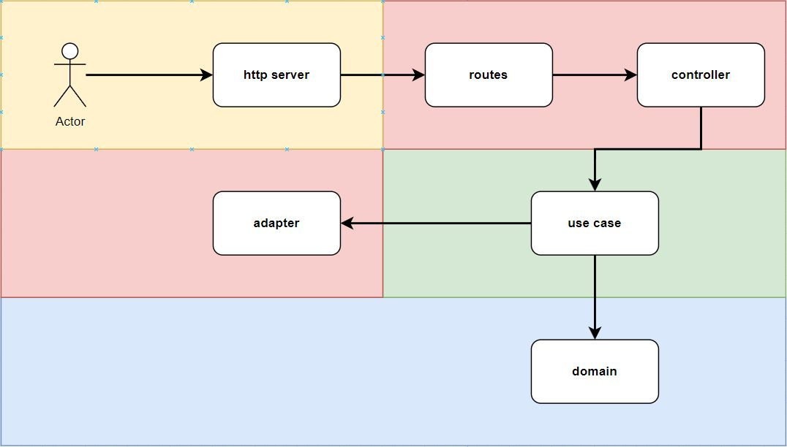
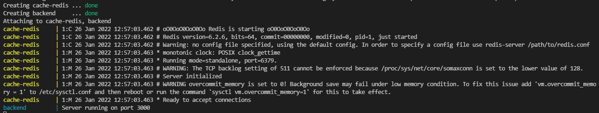
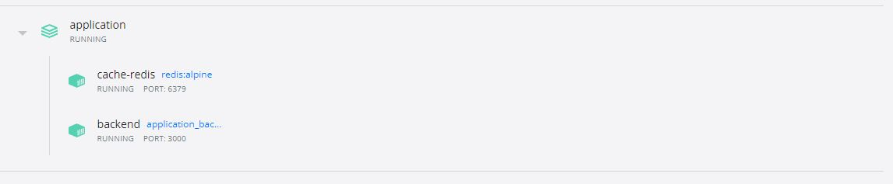

# 🚀 Generador de facturas para empresa telefónica

## Introducción

Este proyecto tiene como objetivo generar una factura en base a los siguientes datos ingresados por el usuario:

- Número de teléfono
- Rango de fecha de facturación
- Csv con información a analizar

## Cadena de ejecución para peticiones

Las carpetas se organizaron con el objetivo de separar los conceptos para cada capa de ejecución dentro del proyecto.

El recorrido de un request puede ser el siguiente:



## Pasos para utilizar este proyecto con docker

El proyecto consta de una imagen de redis y otra de node:alpine para levantar el código.

Estos son los pasos para ejecutar localmente con docker:

```bash
$ docker-compose up
```

Si el comando se ejecutó correctamente, deberíamos ver lo siguiente en la consola:




Luego de esto, podremos visualizar el proyecto en el dashboard de docker:

